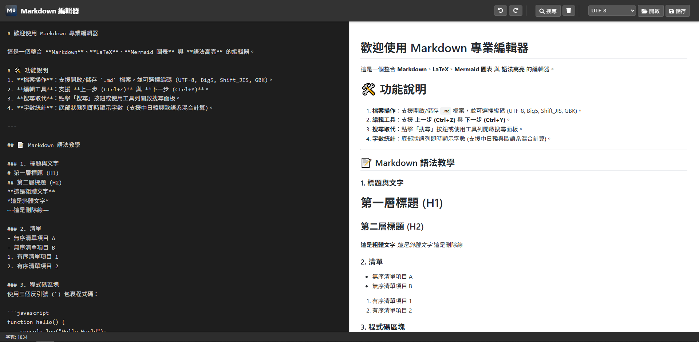
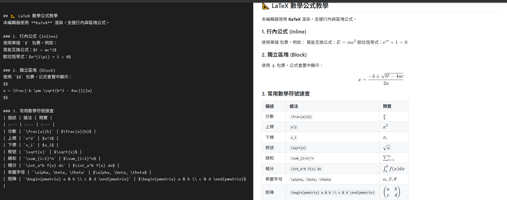
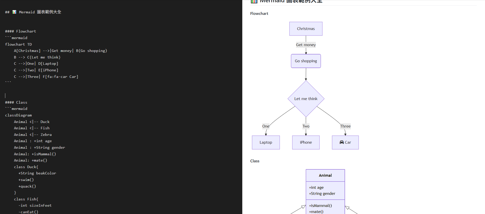
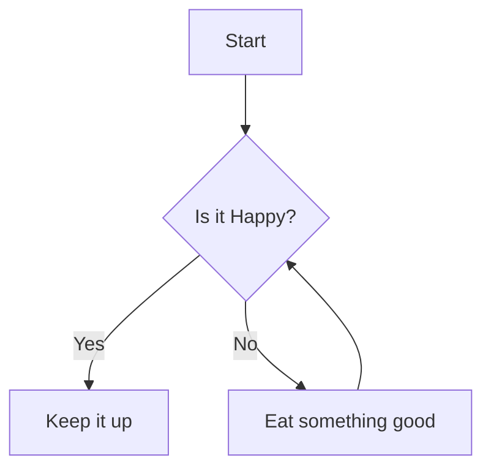

# 📝 Markdown Editor
[中文版本](readme_zh.md)


A lightweight, powerful, browser-based Markdown editor. It features real-time preview, LaTeX mathematical formulas, Mermaid diagrams, and code syntax highlighting. Designed specifically for creative writing, academic note-taking, and developer documentation.





## ✨ Key Features

### 🖊️ Editing Experience
*   **Live Preview**: Edit on the left, see the rendered HTML instantly on the right.
*   **History Management**: Full **Undo** and **Redo** functionality (Ctrl+Z / Ctrl+Y).
*   **Search & Replace**: Built-in search bar supporting keyword lookup and batch replacement.
*   **Smart Word Count**: Precise word counting with support for mixed CJK (Chinese, Japanese, Korean) and Western typography.

### 🎨 Powerful Rendering
*   **Syntax Highlighting**: Integrated with `Highlight.js`, supporting code highlighting for numerous programming languages.
*   **Math Formulas**: Integrated with `KaTeX`, supporting both Inline ($E=mc^2$) and Block ($$\sum$$) LaTeX math formulas.
*   **Diagram Support**: Integrated with **Mermaid.js**, supporting flowcharts, Gantt charts, sequence diagrams, class diagrams, mind maps, and more.
*   **Security**: Uses `DOMPurify` for HTML sanitization to prevent XSS attacks.

### 📂 File Operations
*   **Local File Access**: Directly read from and save to local `.md` files.
*   **Multi-Encoding Support**: Handles character encoding issues; supports **UTF-8**, **Big5 (Traditional Chinese)**, **GBK (Simplified Chinese)**, and **Shift_JIS (Japanese)**.

## 🚀 Getting Started

Since this project uses native ES Modules (`<script type="module">`), browser CORS security policies **prevent it from being opened by simply double-clicking `index.html`**. You need to run it via a local server.

### Method 1: Using VS Code (Recommended)
1. Install the VS Code extension: **Live Server**.
2. Open the project folder in VS Code.
3. Right-click `index.html` and select "Open with Live Server".

### Method 2: Using Python
If you have Python installed, navigate to the project directory in your terminal and run:

```bash
# Python 3
python -m http.server 8000
```
Then, open your browser and visit `http://localhost:8000`.

### Method 3: Using Node.js
If you have a Node.js environment:
```bash
npx http-server
```

## 📖 Syntax Examples

### Math Formulas (LaTeX)
```latex
$$
x = \frac{-b \pm \sqrt{b^2 - 4ac}}{2a}
$$
```

### Diagrams (Mermaid)
~~~markdown

~~~

## 🛠️ Tech Stack

This project is developed entirely using Vanilla JavaScript with no build step required.

*   **Core**: HTML5, CSS3, JavaScript (ES Modules)
*   **Markdown Parsing**: [Marked.js](https://marked.js.org/)
*   **Math Rendering**: [KaTeX](https://katex.org/)
*   **Diagram Rendering**: [Mermaid.js](https://mermaid.js.org/)
*   **Code Highlighting**: [Highlight.js](https://highlightjs.org/)
*   **HTML Sanitization**: [DOMPurify](https://github.com/cure53/DOMPurify)
*   **Icons**: [Font Awesome](https://fontawesome.com/)

## 📂 Project Structure

```
.
├── index.html       # Main entry page
├── style.css        # Stylesheets
├── icon.png         # Application icon
├── js/
│   ├── main.js      # Entry point
│   ├── editor.js    # Editor core logic
│   ├── markdown.js  # Markdown parsing & extension config
│   ├── count.js     # Word count logic
│   ├── file.js      # File I/O handling
│   ├── search.js    # Search & replace functionality
│   └── utils.js     # Utility functions (Debounce, etc.)
└── README.md        # Documentation
```

## 🤝 Contributing

Contributions are welcome! Please feel free to submit a Pull Request or report an Issue.
1. Fork the Project
2. Create your Feature Branch (`git checkout -b feature/AmazingFeature`)
3. Commit your Changes (`git commit -m 'Add some AmazingFeature'`)
4. Push to the Branch (`git push origin feature/AmazingFeature`)
5. Open a Pull Request

## 📄 License

Distributed under the [MIT License](LICENSE).
