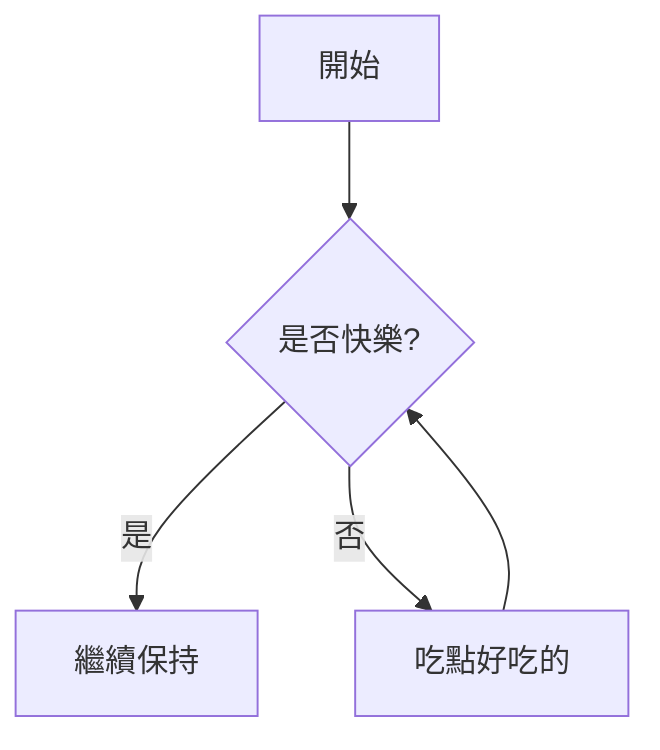

# 📝 Markdown Editor
[English version](readme.md)


一個輕量級、功能強大且基於瀏覽器的 Markdown 編輯器。支援即時預覽、LaTeX 數學公式、Mermaid 圖表繪製以及程式碼語法高亮。專為寫作、學術筆記與開發者文檔設計。


## ✨ 主要特色

### 🖊️ 編輯體驗
*   **即時預覽**：左側編輯，右側即時渲染 HTML。
*   **歷史紀錄**：支援完整的 **復原 (Undo)** 與 **重做 (Redo)** 功能 (Ctrl+Z / Ctrl+Y)。
*   **搜尋與取代**：內建搜尋列，支援關鍵字查找與批次取代。
*   **智慧字數統計**：精確計算字數，完美支援 CJK (中日韓) 與西文混合排版。

### 🎨 強大的渲染能力
*   **語法高亮**：整合 `Highlight.js`，支援多種程式語言的程式碼高亮。
*   **數學公式**：整合 `KaTeX`，支援 Inline ($E=mc^2$) 與 Block ($$\sum$$) 級別的 LaTeX 數學公式。
*   **圖表繪製**：整合 **Mermaid.js**，支援流程圖、甘特圖、循序圖、類別圖、心智圖等多種視覺化圖表。
*   **安全性**：使用 `DOMPurify` 進行 HTML 淨化，防止 XSS 攻擊。

### 📂 檔案操作
*   **本地讀寫**：直接讀取與儲存本地 `.md` 檔案。
*   **多編碼支援**：解決亂碼問題，支援 **UTF-8**、**Big5 (繁中)**、**GBK (簡中)** 與 **Shift_JIS (日文)** 編碼讀取。

## 🚀 如何執行 (Getting Started)

由於本專案使用原生 ES Modules (`<script type="module">`)，基於瀏覽器的 CORS 安全策略，**不能直接雙擊 `index.html` 開啟**。你需要透過本地伺服器 (Local Server) 執行。

### 方法 1：使用 VS Code (推薦)
1. 安裝 VS Code 擴充套件：**Live Server**。
2. 在 VS Code 開啟本專案資料夾。
3. 在 `index.html` 按右鍵，選擇 "Open with Live Server"。

### 方法 2：使用 Python
如果你已安裝 Python，請在終端機 (Terminal) 進入專案目錄並執行：

```bash
# Python 3
python -m http.server 8000
```
然後打開瀏覽器訪問 `http://localhost:8000`。

### 方法 3：使用 Node.js
如果你有 Node.js 環境：
```bash
npx http-server
```

## 📖 語法範例

### 數學公式 (LaTeX)
```latex
$$
x = \frac{-b \pm \sqrt{b^2 - 4ac}}{2a}
$$
```

### 流程圖 (Mermaid)
~~~markdown

~~~

## 🛠️ 技術棧 (Tech Stack)

本專案完全使用原生 JavaScript (Vanilla JS) 開發，無須編譯步驟 (No Build Step)。

*   **核心語言**: HTML5, CSS3, JavaScript (ES Modules)
*   **Markdown 解析**: [Marked.js](https://marked.js.org/)
*   **數學渲染**: [KaTeX](https://katex.org/)
*   **圖表渲染**: [Mermaid.js](https://mermaid.js.org/)
*   **程式碼高亮**: [Highlight.js](https://highlightjs.org/)
*   **HTML 淨化**: [DOMPurify](https://github.com/cure53/DOMPurify)
*   **圖示**: [Font Awesome](https://fontawesome.com/)

## 📂 專案結構

```
.
├── index.html       # 主頁面
├── style.css        # 樣式表
├── icon.png         # 應用程式圖示
├── js/
│   ├── main.js      # 程式進入點
│   ├── editor.js    # 編輯器核心邏輯
│   ├── markdown.js  # Markdown 解析與擴充配置
│   ├── count.js     # 字數統計邏輯
│   ├── file.js      # 檔案讀寫處理
│   ├── search.js    # 搜尋與取代功能
│   └── utils.js     # 工具函式 (Debounce 等)
└── README.md        # 說明文件
```

## 🤝 貢獻 (Contributing)

歡迎提交 Pull Request 或回報 Issue！
1. Fork 本專案
2. 建立你的 Feature Branch (`git checkout -b feature/AmazingFeature`)
3. 提交修改 (`git commit -m 'Add some AmazingFeature'`)
4. 推送到分支 (`git push origin feature/AmazingFeature`)
5. 開啟 Pull Request

## 📄 授權 (License)


本專案採用 [MIT License](LICENSE) 授權。
